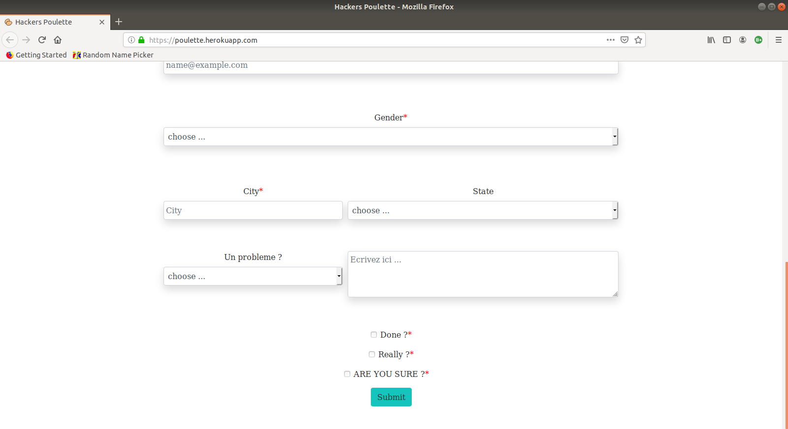

# Hackers-Poulette

#### La société _Hackers Poulette ™_ vend des kits d'accessoires Raspberry Pi

#### le but ici est de créer un formulaire & un page de reponse favorable ou non suivant le submit effectué.

####  Mockup and construction

## [Check here !](https://poulette.herokuapp.com/) 

### Un peu de visuel

### This Form is build with 
#### - Bootstrap
#### - "HTML" sémantic
#### - PHP
#### - Css

##### It's my first real project with PHP so i tried my best ! _( the best incoming i'm sure !)_ 

#### Credit

##### Author of this Beautiful, Awesome and Amazing README is me [_( Jérémy Englebert)_](https://www.linkedin.com/in/jeremy-englebert/)
